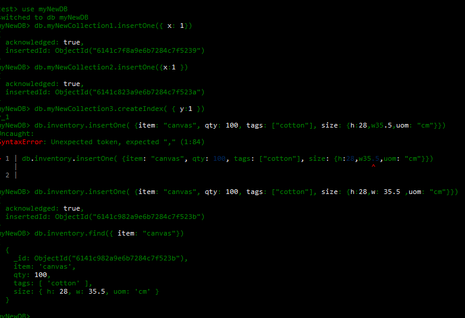
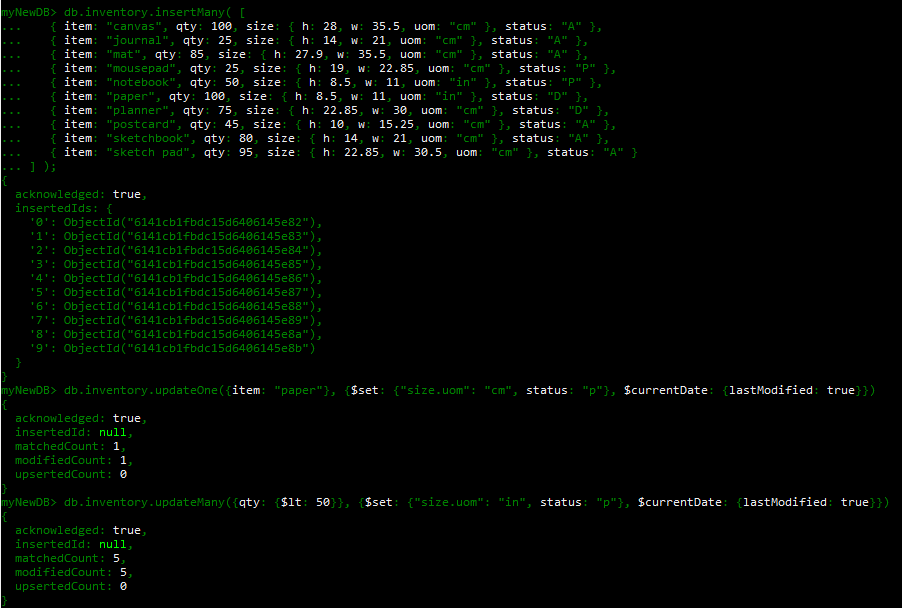
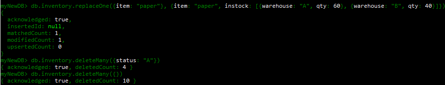
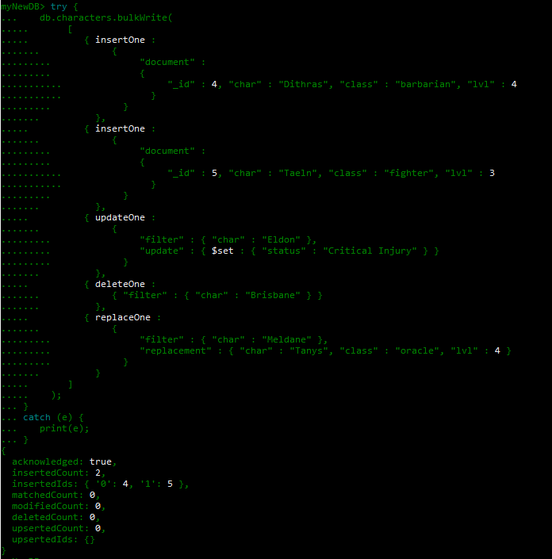
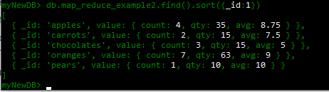
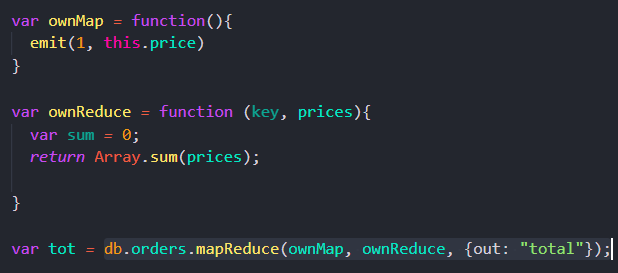

# Expass 3 report

by Sondre Lindaas Gjesdal

## Technical difficulties

I've had some difficulties getting mongosh to work, but after some moments of confusion I got the grips of it using the mongosh in powershell with the help of the tutorial

## Screenshots

## Own function

I decided to make a mapreduce function that returns the overall price of every order. This is useful for finding out the income of all orders.

## Issues

No pending issues.
